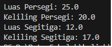

# Implementasi Pola Desain Builder Pada Domain Kasus Bangun Datar

## Deskripsi
Builder adalah creational design pattern yang memungkinkan dalam membangun objek kompleks langkah demi langkah. Pola ini memungkinkan untuk menghasilkan berbagai jenis dan representasi dari suatu objek menggunakan kode konstruksi yang sama.

## Contoh Hasil
